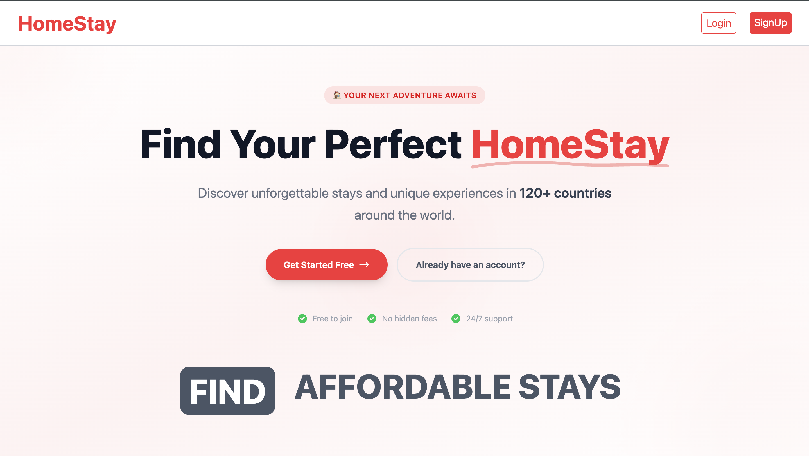
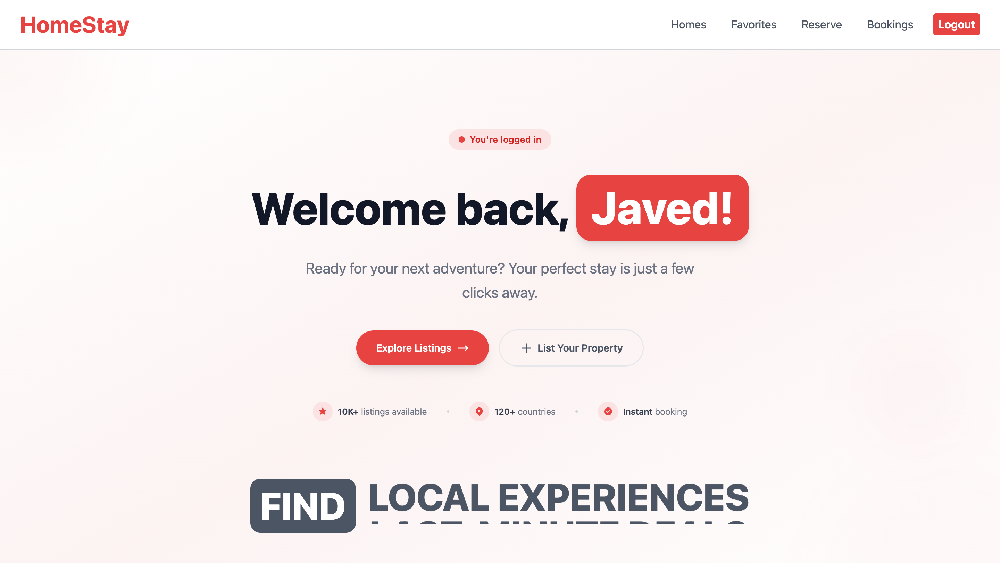
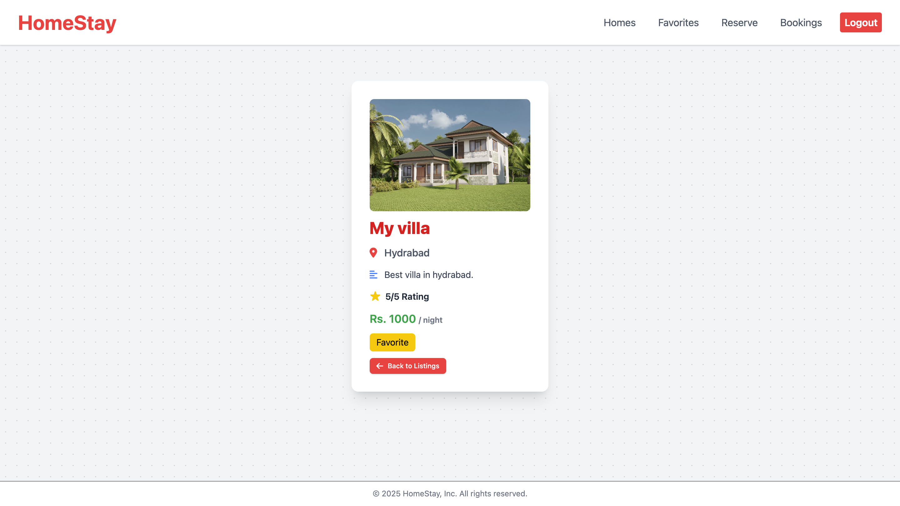
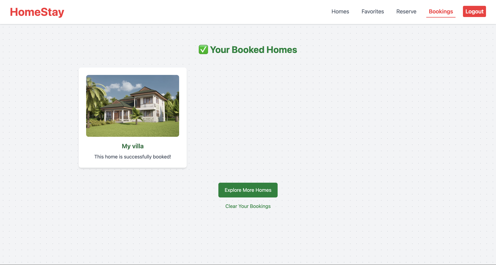
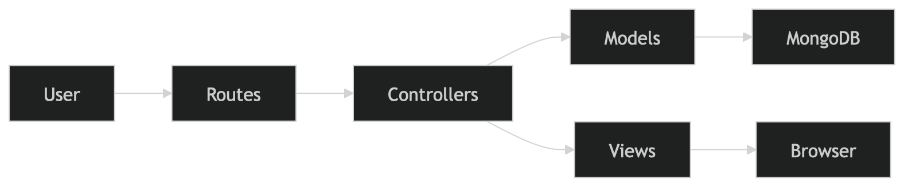

<div align="center">

# 🏠HomeStay

Property rental platform inspired by Airbnb, built with Node.js, Express, MongoDB, EJS, and Tailwind CSS.


</div>

## Overview

A full-stack web application built with Node.js, Express, and MongoDB that mimics the core functionalities of a property rental marketplace like Airbnb. The platform supports role-based user flows, allowing users to register as either guests or hosts. Guests can browse available homes, manage favorites, make reservations, and book stays. Hosts have full CRUD (Create, Read, Update, Delete) capabilities to manage property listings, including secure image and PDF uploads.

## Demo


## Highlights

- Implemented role-based authentication and authorization.
- Built a complete property management workflow with CRUD operations.
- Developed reservation, favorites, and booking systems.
- Integrated secure file uploads using Multer.
- Implemented MongoDB-backed session management.
- Followed MVC architecture for maintainability and scalability.

## Features

### Authentication & Authorization
- User registration and login
- Secure password hashing
- Role-based access control
- MongoDB-backed sessions

### Property Management
- Create, edit, and delete listings
- Image uploads
- PDF house rules uploads
- Automatic cleanup of related references

### Guest Experience
- Browse properties
- Manage favorites
- Reserve homes
- Book stays
- Clear booking history

## Screenshots

<table>
<tr>
<td></td>
<td></td>
</tr>
<tr>
<td></td>
<td></td>
</tr>
</table>

## Tech Stack

| Category | Technologies |
| :--- | :--- |
| **Backend** | Node.js, Express.js |
| **Database** | MongoDB, Mongoose |
| **Authentication & Sessions** | `bcryptjs`, `express-session`, `connect-mongodb-session` |
| **Templating Engine** | EJS (Embedded JavaScript) |
| **Styling** | Tailwind CSS (v4), PostCSS, Autoprefixer |
| **File Handling** | Multer |
| **Environment Management** | `dotenv` |

## Architecture

The application follows a traditional **MVC (Model-View-Controller)** architecture and relies on Server-Side Rendering (SSR):



## Project Structure

```text
├── app.js                 # Application entry point and server setup
├── .env                   # Environment variables (PORT, MONGO_URL)
├── package.json           # Dependencies and NPM scripts
├── tailwind.config.js     # Tailwind CSS configuration
├── postcss.config.js      # PostCSS configuration
├── controllers/           # Route handler logic
│   ├── authController.js
│   ├── hostController.js
│   └── storeController.js
├── models/                # Database schemas
│   ├── home.js            # Home/Property schema
│   └── user.js            # User schema (Guest/Host)
├── routes/                # Express router definitions
│   ├── authRouter.js
│   ├── hostRouter.js
│   └── storeRouter.js
├── views/                 # EJS Templates
│   ├── auth/              # Login, Signup templates
│   ├── host/              # Add, Edit, Delete property templates
│   ├── store/             # Home listings, Bookings, Favorites templates
│   ├── partials/          # Reusable UI components (Navbars, Footers)
│   ├── 404Page.ejs        # Custom 404 error page
│   └── input.css          # Source Tailwind CSS file
├── public/                # Static assets (compiled CSS)
├── uploads/               # Locally stored user-uploaded files (images/PDFs)
└── utils/                 # Helper utilities (e.g., path resolving)
```

## Installation

1.  Clone the repository to your local machine.
2.  Navigate to the project directory:
    ```bash
    cd "homeStay"
    ```
3.  Install the necessary dependencies:
    ```bash
    npm install
    ```

## Environment Variables

Create a `.env` file in the root directory of the project and define the following variables:

| Variable | Description | Example |
| :--- | :--- | :--- |
| `PORT` | The port number the server will listen on. | `5678` |
| `MONGO_URL` | The connection string for your MongoDB database. | `mongodb+srv://<user>:<password>@cluster.mongodb.net/` |

## Running Locally

To start the application in **development mode** (with auto-reloading for the server and Tailwind CSS compilation):

```bash
npm run dev
```

To start the application in **production mode**:

```bash
npm start
```

The server will start running at `http://localhost:<PORT>` (e.g., `http://localhost:5678`).

## Available Scripts

*   `npm run dev`: Starts the application using `nodemon` for automatic restarts on file changes, and concurrently runs the Tailwind CSS watcher to compile styles.
*   `npm start`: Starts the standard Node.js server and concurrently runs the Tailwind CSS watcher.
*   `npm run build:css`: Runs the Tailwind CLI to compile `views/input.css` into `public/output.css` in watch mode.

## Contributing

Contributions are always welcome! Please fork the repository and create a pull request with your proposed changes.

## License

ISC License (as specified in `package.json`).
